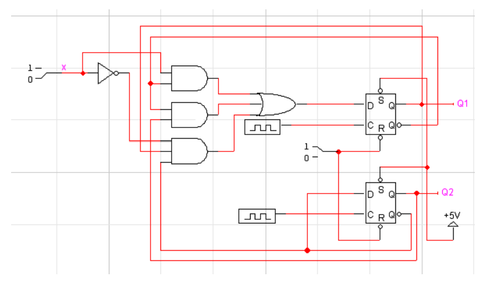
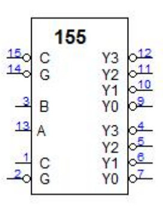

# Experiment #4

## [Problem 1](problem1.md)

다음은 2개의 D flip-flop을 사용한 synchronous sequential circuit이다. 잘못된 부분을 고치고, LogicWorks로 그려서 동작해 보시오. 또 이 회로의 동작을 state diagram으로 설명해 보시오.

## [Problem 2](problem2.md)

다음의 state diagram처럼 동작하는 synchronous sequential network을 JK flip-flop을 이용하여 설계하시오.

## [Problem 3](problem3.md)

입력 X가 있어서 X = 0이면 000 → 001 → 011 → 010 → 110 → 111 → 101 → 100 → 000 → ...으로 변하고, X = 1이면 000 → 001 → 010 → 011 → 100 → 101 → 110 → 111 → 000 → ...으로 변하는 카운터를 설계하고자 한다.

1. 상태전이도(state diagram)을 그리시오.
2. 1을 JK flip-flop으로 설계해 보시오.

## [Problem 4](problem4.md)

다음은 2개의 2 × 4 decoder를 갖는 IC 74155이다. A, B는 decoder input, C는 확장 input, G는 enable(0일 때)이다. 적절한 연결을 통하여 3 × 8 decoder를 만들어 보시오. 단 Output의 의미를 구체적으로 말해야 함. (즉 D0, D1, ... ,D7)

