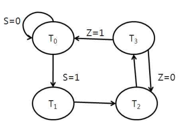
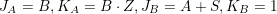
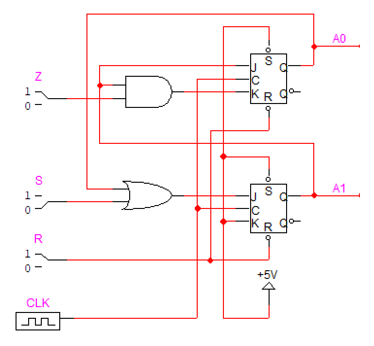

# Problem 2

다음의 state diagram처럼 동작하는 synchronous sequential network을 JK flip-flop을 이용하여 설계하시오.

## Answer

주어진 state diagram을 JK flip-flop을 위한 exitation table로 옮기면 다음 표와 같다.

|   A |   B |   S |   Z |  A+ |  B+ |  JA |  KA |  JB |  KB |
| --: | --: | --: | --: | --: | --: | --: | --: | --: | --: |
|   0 |   0 |   0 |   0 |   0 |   0 |   0 |   X |   0 |   X |
|   0 |   0 |   0 |   1 |   0 |   0 |   0 |   X |   0 |   X |
|   0 |   0 |   1 |   0 |   0 |   1 |   0 |   X |   1 |   X |
|   0 |   0 |   1 |   1 |   0 |   1 |   0 |   X |   1 |   X |
|   0 |   1 |   0 |   0 |   1 |   0 |   1 |   X |   X |   1 |
|   0 |   1 |   0 |   1 |   1 |   0 |   1 |   X |   X |   1 |
|   0 |   1 |   1 |   0 |   1 |   0 |   1 |   X |   X |   1 |
|   0 |   1 |   1 |   1 |   1 |   0 |   1 |   X |   X |   1 |
|   1 |   0 |   0 |   0 |   1 |   1 |   X |   0 |   1 |   X |
|   1 |   0 |   0 |   1 |   1 |   1 |   X |   0 |   1 |   X |
|   1 |   0 |   1 |   0 |   1 |   1 |   X |   0 |   1 |   X |
|   1 |   0 |   1 |   1 |   1 |   1 |   X |   0 |   1 |   X |
|   1 |   1 |   0 |   0 |   1 |   0 |   X |   0 |   X |   1 |
|   1 |   1 |   0 |   1 |   1 |   0 |   X |   1 |   X |   1 |
|   1 |   1 |   1 |   0 |   1 |   0 |   X |   0 |   X |   1 |
|   1 |   1 |   1 |   1 |   1 |   0 |   X |   1 |   X |   1 |

표에서 이다. 이를 바탕으로 회로로 그린 것이 아래 그림과 같다.

