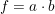

# Experiment #5

## [Problem 1](problem1.md)

1. 2개의 open-collector buffer만을 연결하여 가 되도록 해 보시오.
2. 2개의 open-collector NAND gate와 NOT gate 하나를 이용하여 가 되도록 연결해 보시오.
3. 2개의 tri-state buffer와 하나의 NOT gate를 이용하여 2 × 1 multiplexer를 만들어 보시오.
4. 3을 수정하여 E (Enable) input이 있는 2 × 1 multiplexer를 만들어 library 형태로 저장하시오. 단 E = 0이면 정상적인 multiplexer로 동작하나 E = 1이면 출력은 high impedance state (끊어진 것처럼 동작하는 상태)가 된다.
5. 4에서 만든 multiplexer library를 여러 개 이용하여 8 × 1의 multiplexer를 만들어 보시오. 단 주어진 multiplexer 외에 필요하다면 다른 소자(예를 들면 decoder, gate 등)를 사용해도 무방함.

## [Problem 2](problem2.md)

다음은 십진수를 나타낼 때 흔히 이용되는 7-세그멘트(segment) 디스플레이와 BCD 코드를 입력으로 하여 7-세그멘트로 내보내는 부분의 개략도를 그린 것이다. 7-세그멘트 디스플레이에서 해당 위치(a, b, ... ,g)가 1이면 그 위치의 라이트(light)가 켜진다. 지난 시간에 본 74155 decoder와 적절한 게이트들을 사용하여 이 부분을 완성해 보시오.

## [Problem 3](problem3.md)

다음에 주어진 ripple counter의 동작을 설명해 보시오.

