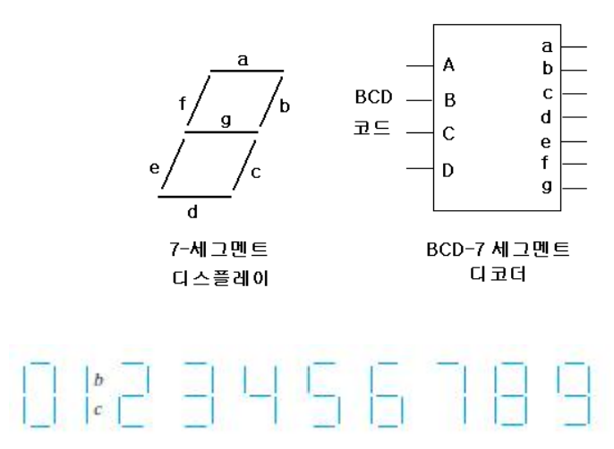
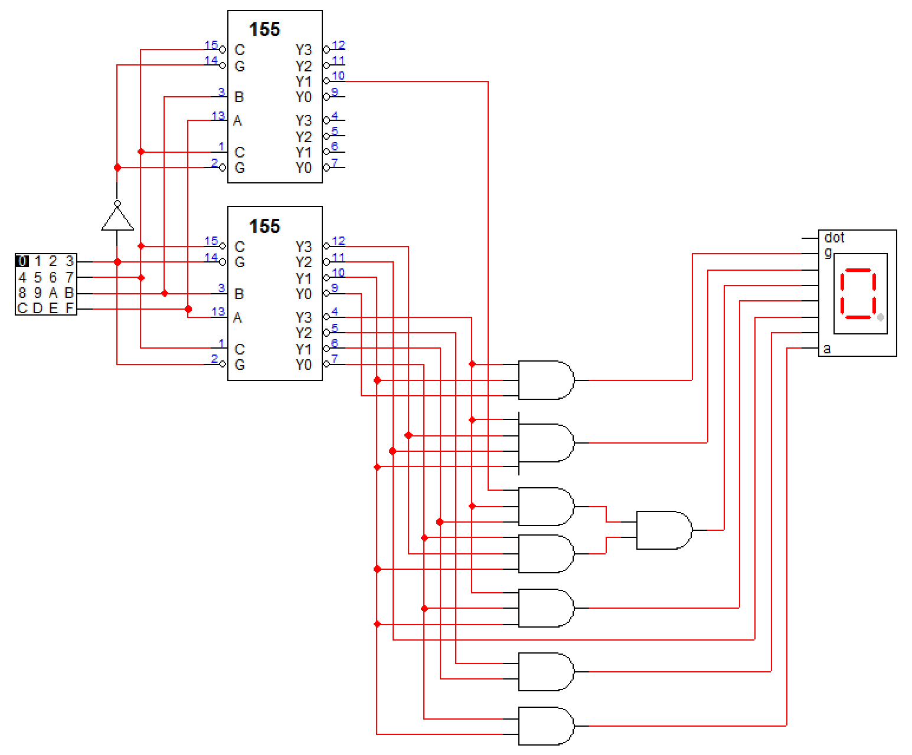

# Problem 2

다음은 십진수를 나타낼 때 흔히 이용되는 7-세그멘트(segment) 디스플레이와 BCD 코드를 입력으로 하여 7-세그멘트로 내보내는 부분의 개략도를 그린 것이다. 7-세그멘트 디스플레이에서 해당 위치(a, b, ... ,g)가 1이면 그 위치의 라이트(light)가 켜진다. 지난 시간에 본 74155 decoder와 적절한 게이트들을 사용하여 이 부분을 완성해 보시오.

## Answer

74155의 출력 값이 반전되어 나온다는 점에 주목해서, 0인 값들을 모아 AND로 묶어 해당 위치로 보내주도록 회로를 만들었다.

예를 들어 a 위치가 켜지는 숫자는 0, 2, 3, 5, 6, 7, 8, 9가 있는데, 74155에서 해당 숫자일 때 1이 출력되었다면 해당 숫자들을 OR 연산해서 a 위치로 보냈을텐데, 출력 값이 반전되어 해당 숫자일 때 0이 출력되므로 드 모르간의 법칙에 의해 1, 4의 출력부분을 AND로 묶어 a 위치로 보내주는 방식이다.
