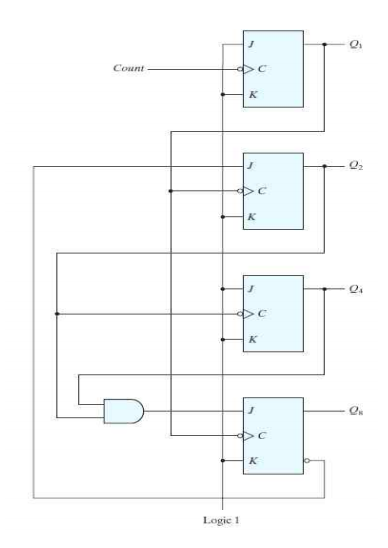
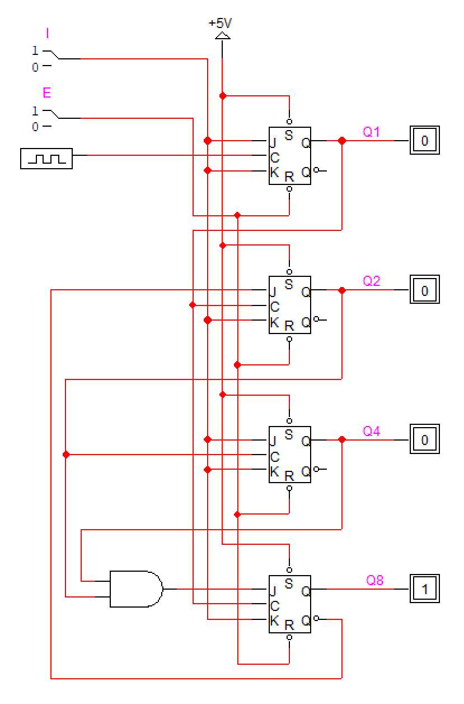
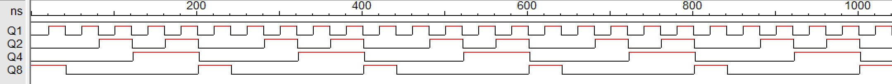

# Problem 3

다음에 주어진 ripple counter의 동작을 설명해 보시오.

## Answer

위 ripple counter의 동작은 다음과 같다.

- 첫번째 JK flip-flop에서, J와 K는 input과 같고 C는 CLK과 동기화된다. 따라서 input이 0일 때 Q는 변화가 없고, input이 1일때는 클럭의 하강 엣지 마다 토글된다.

- 두번째 JK flip-flop에서, J는 NOT Q4와 같고, K는 input과 같다. C는 Q1에 동기화되는데, input이 0이면 Q1의 변화가 없으므로 Q2 또한 변화가 없고, input이 1이면 Q8이 0일때는 토글, Q8이 1일일 때 0으로 출력된다.

- 세번째 JK flip-flop에서, J와 K는 input과 같고 C는 Q2와 동기화된다. 따라서 input이 0일 때 Q는 변화가 없고, input이 1일때는 Q2의 하강 엣지마다 토글된다.

- 네번째 JK flip-flop에서, J는 Q2 AND Q3이고, K는 input과 같다. 또 C는 Q1에 동기화되는데, input이 0이면 Q1의 변화가 없으므로 Q4 또한 변화가 없고, input이 1일 때 Q2, Q3 둘 중 하나라도 0이면 0, 둘 다 1이면 Q4는 토글된다.

요약하자면 input이 0일 때 이 회로의 출력값은 계속 유지되고, input이 1이면 다음 그림과 같이 사이클을 돌게 된다.

