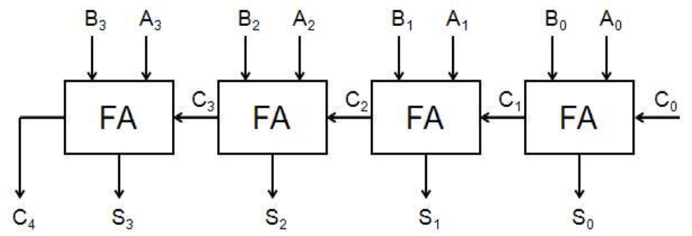
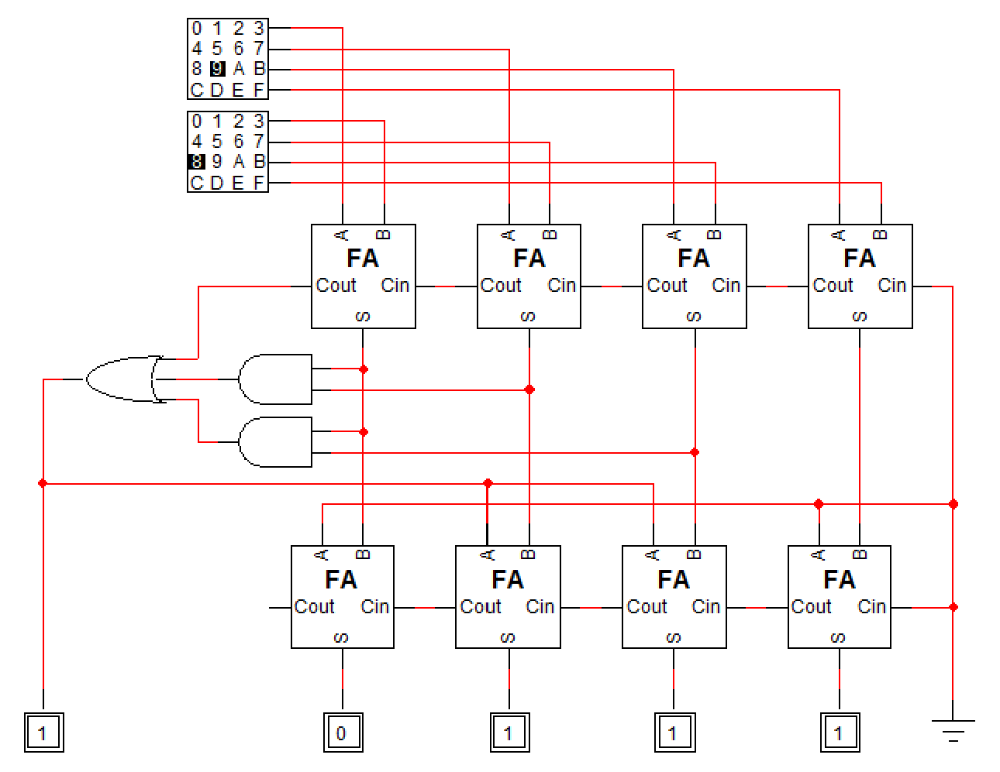

# Problem 2

다음은 full adder를 직렬로 연결한 ripple carry adder이다.

1. 위를 보완하여 BCD adder를 만들어 보시오.

2. 1을 ROM으로 만든다면 필요한 크기는 얼마인가? (word의 수 \* word의 크기로 답하시오)

## Answer

### 1.

4 비트 BCD 코드의 최대값은 1001(9)이다. 따라서 입력의 최대값도 1001(9)라고 할 수 있다. 이때 출력은 carry까지 고려하면 0부터 1+9+9=19까지라고 볼 수 있다.

0부터 9까지 이진수의 덧셈 결과와 BCD 코드의 덧셈 결과는 같다. 그리고 10부터 19까지의 덧셈 결과는 정확히 6씩 차이가 난다.

0부터 19까지의 수 중 10부터 19까지의 수는 다음 조건을 만족시킨다:

- C = 1
- S3 = 1 && S2 = 1
- S3 = 1 && S1 = 1

위 식를 이용해 기존 ripple carry adder의 결과에, 조건을 만족시키는 항에 6씩 더해주면 BCD adder를 만들 수 있다.

### 2.

위를 ROM으로 만든다면, 입력이 9개이고 출력이 5개이므로, word의 수는 2^9, word의 크기는 5이다. 즉 2^9 \* 5의 크기가 필요하다.
