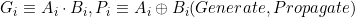
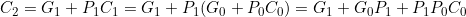
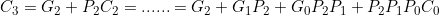
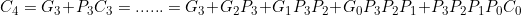

# Experiment #8

다음은 full adder를 직렬로 연결한 ripple carry adder이다.

## Problem 1

위를 개선하여 carry lookahead adder를 만들고 test한 후 library에 추가하시오. 이를 위한 식은 다음과 같다.

## Problem 2

Ripple carry adder의 delay를 4d라고 하면 앞에서 만든 carry lookahead adder의
delay는 3d임을 설명하시오. 단 d는 two-level network의 delay이다.

## Problem 3

Problem 1에서 얻은 adder를 4개 연결하여 16-bit adder를 구성해 보시오. 단 다음과 같이 변형된 full adder를 이용한다.

## Problem 4

문제 3에서 만든 16-bit adder에 다음의 output을 추가하시오.

- C (Carry): 16 bit 연산 결과의 carry
- Z (Zero): 16-bit 연산 결과가 0 (zero)인 경우 1
- S (Sign): 16-bit 연산 결과가 negative이면 1, positive이면 0
- V (oVerflow): 16-bit 연산 결과가 overflow이면 1
