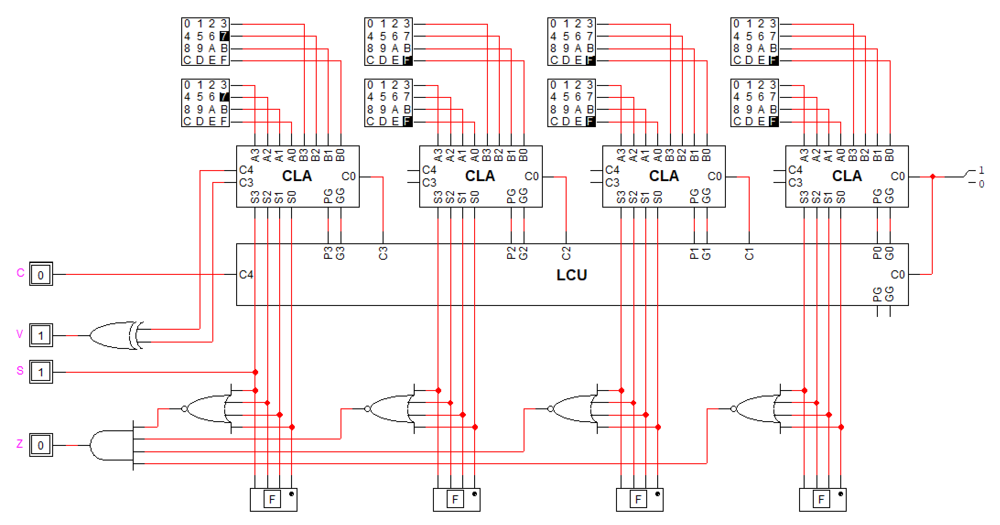

# Problem 4

문제 3에서 만든 16-bit adder에 다음의 output을 추가하시오.

- C (Carry): 16 bit 연산 결과의 carry
- Z (Zero): 16-bit 연산 결과가 0 (zero)인 경우 1
- S (Sign): 16-bit 연산 결과가 negative이면 1, positive이면 0
- V (oVerflow): 16-bit 연산 결과가 overflow이면 1

## Answer

- C (carry): LCU의 carry out과 같다.
- Z (zero): 모든 자릿수가 0이면 1과 같다. 따라서 모든 S를 NOR 연산한 것과 같다. (여기서는 4개씩 나누어 NOR 연산한 뒤, AND로 합쳐주는 방법으로 구현했다.)
- S (sign): 가장 높은 자릿수 (S15)와 같다.
- V (overflow): 가장 높은 두개의 carry 값을 XOR 연산한 것과 같다.
