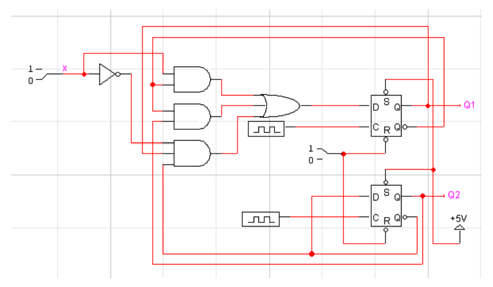
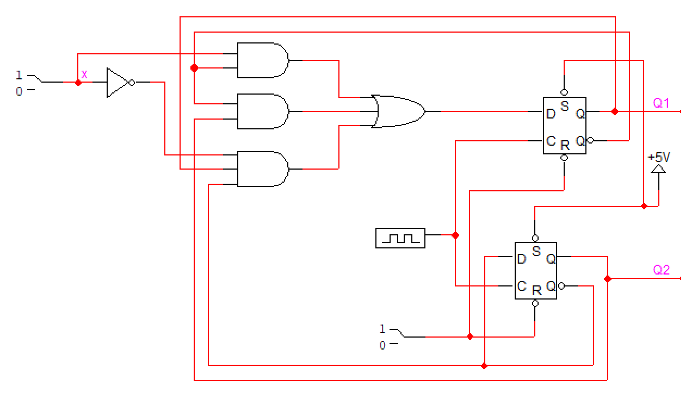
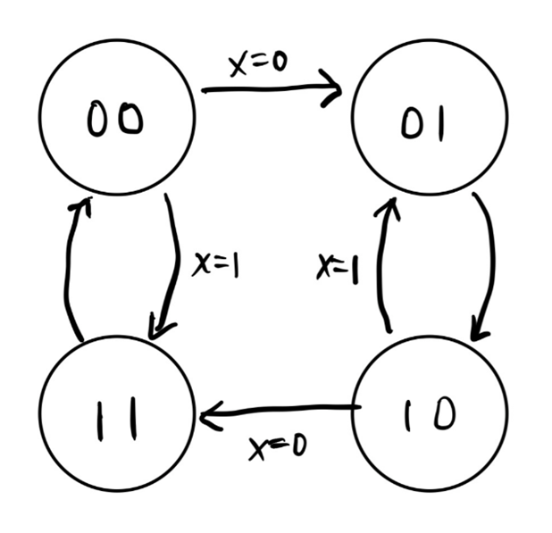

# Problem 1

다음은 2개의 D flip-flop을 사용한 synchronous sequential circuit이다. 잘못된 부분을 고치고, LogicWorks로 그려서 동작해 보시오. 또 이 회로의 동작을 state diagram으로 설명해 보시오.

## Answer

synchronous sequential circuit로 만들기 위해 두 D flip-flop에 각각 연결되어 있던 clock을 하나로 합쳐주었다.

그리고 이 회로의 동작을 state diagram으로 나타내면 위와 같다.
