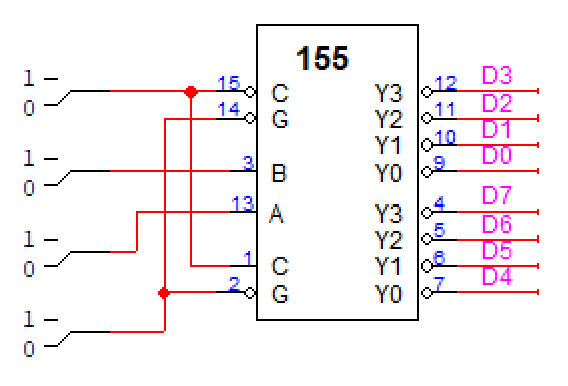

# Problem 4

다음은 2개의 2 × 4 decoder를 갖는 IC 74155이다. A, B는 decoder input, C는 확장 input, G는 enable(0일 때)이다. 적절한 연결을 통하여 3 × 8 decoder를 만들어 보시오. 단 Output의 의미를 구체적으로 말해야 함. (즉 D0, D1, ... ,D7)

## Answer

G를 enable (0) 한 뒤에, A (2^0), B (2^1), C (2^2) 를 바꿔가면서 각 output이 표시하는 숫자를 찾아보았더니, 위 그림과 같이 위에서부터 차례대로 D3, D2, D1, D0, D7, D6, D5, D4의 출력값을 나타내는 것을 알 수 있었다.
