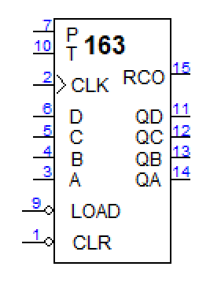
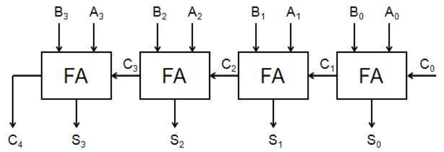

# Experiment #6

## [Problem 1](problem1.md)

74163 counter를 이용하여 다음과 같은 동작을 하는 counter를 각각 만들어 보시오.

1. 0 → 1 → 2 → ... → 8 → 9 → 0 → 1 → ...
2. 9 → 10 → 11 → ... → 15 → 9 → 10 → ...
3. 0 → 1 → ... →15 → 16 → 17 → 18 → 19 → 20 → 0 → 1 → 2 → ...

단 74163의 pin description은 아래와 같다.

- P: increment
- T: increment & RCO enable (QD QC QB QA = 1111일 때)
- P & T = 1일 때 increment
- LOAD: 0일 때 DCBA load
- CLR: 0일 때 reset

## [Problem 2](problem2.md)

다음은 full adder를 직렬로 연결한 ripple carry adder이다.

1. 위를 보완하여 BCD adder를 만들어 보시오.

2. 1을 ROM으로 만든다면 필요한 크기는 얼마인가? (word의 수 \* word의 크기로 답하시오)
