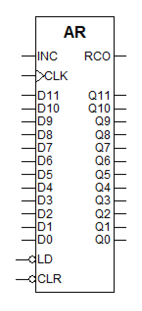
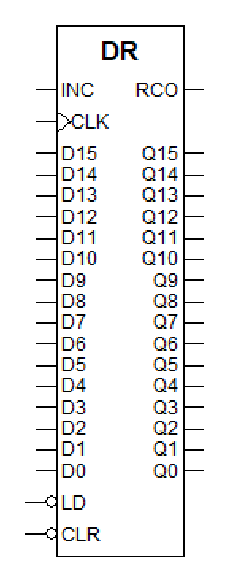
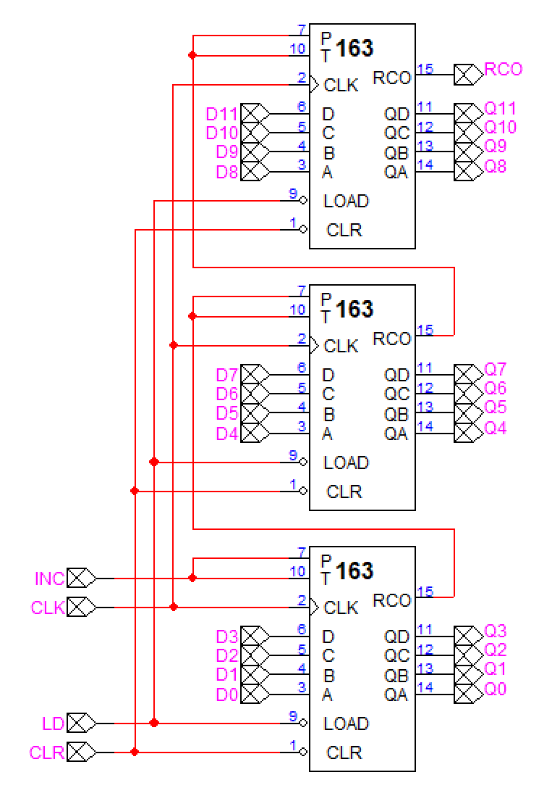
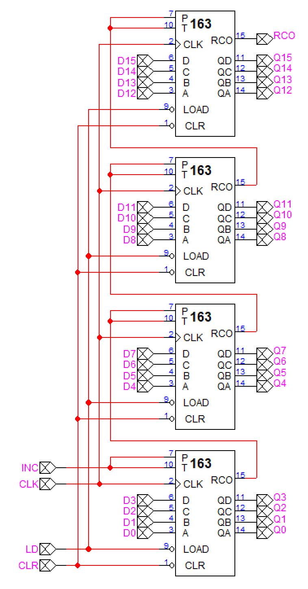

# Problem 1

다음과 같은 두 종류의 register를 74163을 이용하여 만들고 library로 저장하시오.

### 1. Address register : 12-bit

CLR (0으로 만든다), INR (증가시킨다), LOAD (값을 적재함)의 세 입력을 가짐.

### 2. Data register: 16-bit

CLR (0으로 만든다), INR (증가시킨다), LOAD (값을 적재함)의 세 입력을 가짐.

## Answer

