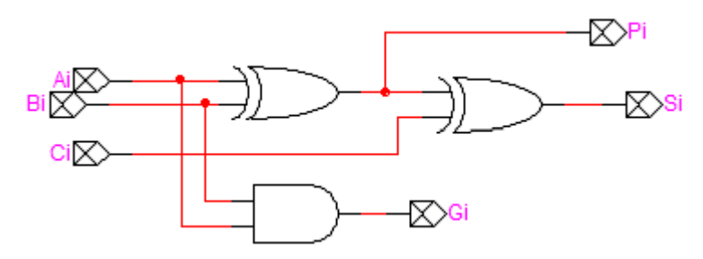
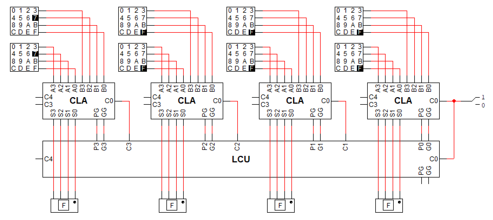
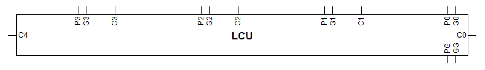

# Problem 3

Problem 1에서 얻은 adder를 4개 연결하여 16-bit adder를 구성해 보시오. 단 다음과 같이 변형된 full adder를 이용한다.

## Answer

4개의 CLA와 1개의 LCU를 연결해서 16-bit adder를 만들 수 있다. 이 때 각 CLA의 PG와 GG는 위에서 간략히 설명한 것과 같이 더 높은 수준의 adder를 만들 때 P와 G로 사용될 수 있다.

- 
- 
- 

또한 여기서 사용된 LCU는 4-bit CLA를 만들 때 사용한 LCU와 내부 회로는 완전히 같고 회로도를 위해 크기와 핀의 이름만 다른 같은 유닛이다.
