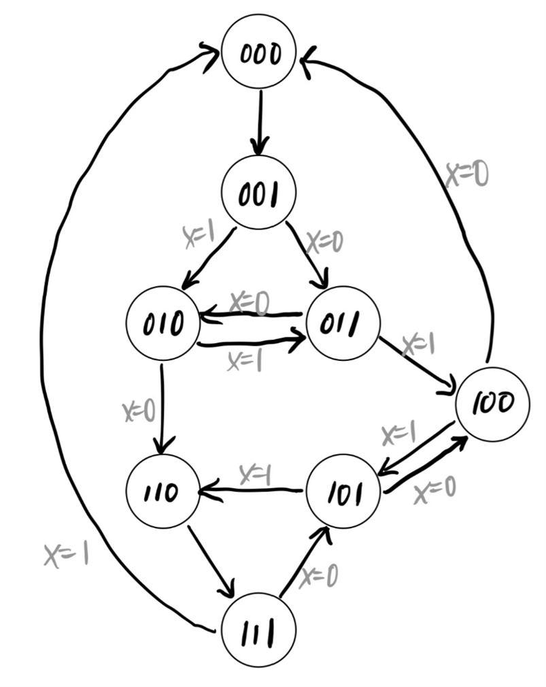
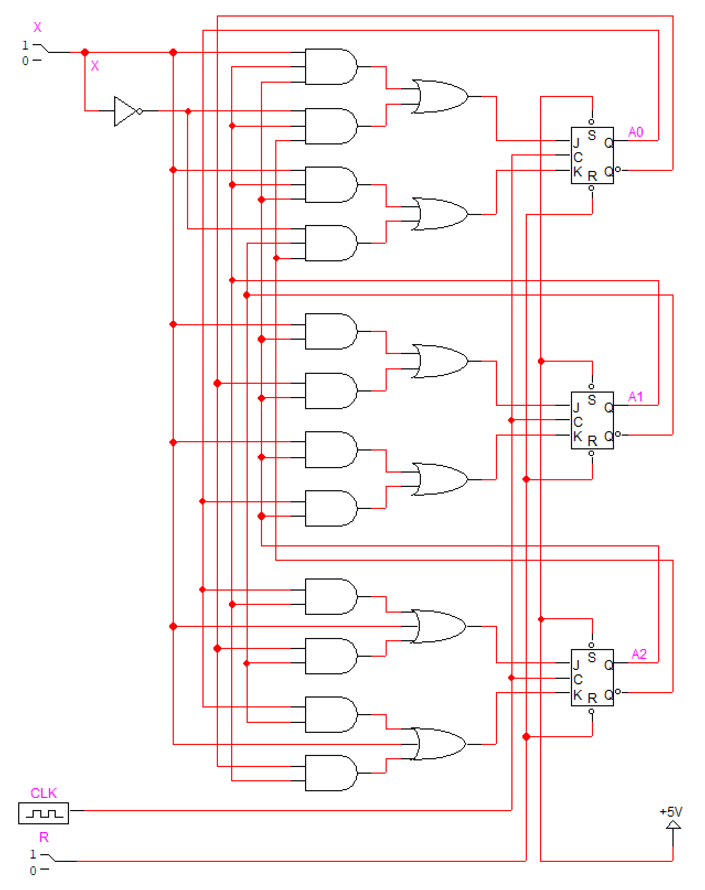

# Problem 3

입력 X가 있어서 X = 0이면 000 → 001 → 011 → 010 → 110 → 111 → 101 → 100 → 000 → ...으로 변하고, X = 1이면 000 → 001 → 010 → 011 → 100 → 101 → 110 → 111 → 000 → ...으로 변하는 카운터를 설계하고자 한다.

1. 상태전이도(state diagram)을 그리시오.
2. 1을 JK flip-flop으로 설계해 보시오.

## Answer

문제에서 주어진 카운터를 JK flip-flop을 위한 exitation table로 만들면 다음 표와 같다.

|   X |   A |   B |   C |  A+ |  B+ |  C+ |  JA |  KA |  JB |  KB |  JC |  KC |
| --: | --: | --: | --: | --: | --: | --: | --: | --: | --: | --: | --: | --: |
|   0 |   0 |   0 |   0 |   0 |   0 |   1 |   0 |   X |   X |   X |   1 |   X |
|   0 |   0 |   0 |   1 |   0 |   1 |   1 |   0 |   X |   X |   X |   X |   0 |
|   0 |   0 |   1 |   0 |   1 |   1 |   0 |   1 |   X |   0 |   0 |   0 |   X |
|   0 |   0 |   1 |   1 |   0 |   1 |   0 |   0 |   X |   0 |   0 |   X |   1 |
|   0 |   1 |   0 |   0 |   0 |   0 |   0 |   X |   1 |   X |   X |   0 |   X |
|   0 |   1 |   0 |   1 |   1 |   0 |   0 |   X |   0 |   X |   X |   X |   1 |
|   0 |   1 |   1 |   0 |   1 |   1 |   1 |   X |   0 |   0 |   0 |   1 |   X |
|   0 |   1 |   1 |   1 |   1 |   0 |   1 |   X |   0 |   1 |   1 |   X |   0 |
|   1 |   0 |   0 |   0 |   0 |   0 |   1 |   0 |   X |   X |   X |   1 |   X |
|   1 |   0 |   0 |   1 |   0 |   1 |   0 |   0 |   X |   X |   X |   X |   1 |
|   1 |   0 |   1 |   0 |   0 |   1 |   1 |   0 |   X |   0 |   0 |   1 |   X |
|   1 |   0 |   1 |   1 |   1 |   0 |   0 |   1 |   X |   1 |   1 |   X |   1 |
|   1 |   1 |   0 |   0 |   1 |   0 |   1 |   X |   0 |   X |   X |   1 |   X |
|   1 |   1 |   0 |   1 |   1 |   1 |   0 |   X |   0 |   X |   X |   X |   1 |
|   1 |   1 |   1 |   0 |   1 |   1 |   1 |   X |   0 |   0 |   0 |   1 |   X |
|   1 |   1 |   1 |   1 |   0 |   0 |   0 |   X |   1 |   1 |   1 |   X |   1 |

그리고 주어진 카운터를 state diagram으로 그리면 아래 그림과 같다.

표에서 이고, 이를 바탕으로 회로를 그리면 아래 그림과 같다.

