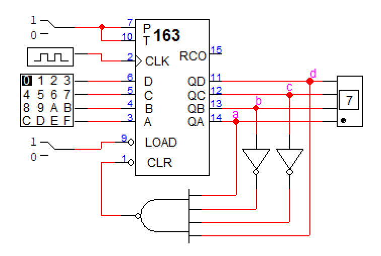
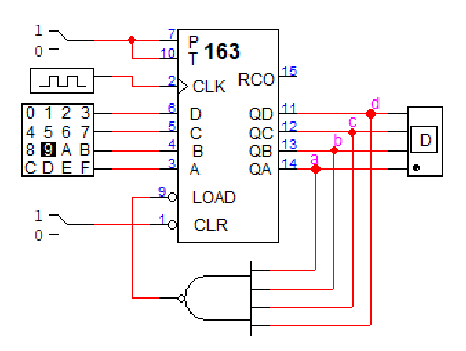

# Problem 1

74163 counter를 이용하여 다음과 같은 동작을 하는 counter를 각각 만들어 보시오.

1. 0 → 1 → 2 → ... → 8 → 9 → 0 → 1 → ...
2. 9 → 10 → 11 → ... → 15 → 9 → 10 → ...
3. 0 → 1 → ... →15 → 16 → 17 → 18 → 19 → 20 → 0 → 1 → 2 → ...

단 74163의 pin description은 아래와 같다.

- P: increment
- T: increment & RCO enable (QD QC QB QA = 1111일 때)
- P & T = 1일 때 increment
- LOAD: 0일 때 DCBA load
- CLR: 0일 때 reset

## Answer

### 1.

출력이 1001(9)일 때 CLR 하도록 만들었다.

### 2.

출력이 1111(15)일 때 1001(9)를 LOAD 하도록 만들었다.

### 3.

74163을 2개 사용해서 두 번째 74163의 CLK에는 첫 번째 74163의 RCO (ripple carry out)를 CLK 신호로 주어 첫 번째 74163의 cycle이 한 번 돌 때 마다 두 번째 74163이 1씩 increment 되도록 설계하였다. 그리고 문제와 같은 동작을 위해 출력이 10100(20) 일 때 두 74163을 CLR 하도록 만들었다.
