# Problem 1

다음은 full adder를 직렬로 연결한 ripple carry adder이다.

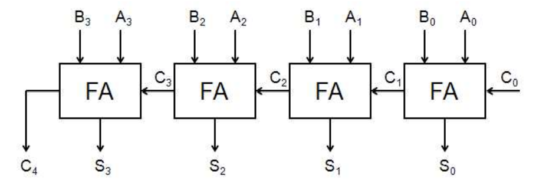

위를 개선하여 carry lookahead adder를 만들고 test한 후 library에 추가하시오. 이를 위한 식은 다음과 같다.

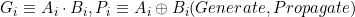

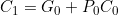

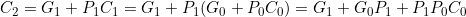

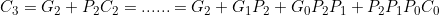

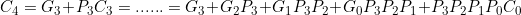

## Answer

Full adder의 carry in이 이전 full adder의 carry out이므로, 하나의 full adder가 계산되기 위해 이전 adder의 연산을 기다려야 하므로 ripple carry adder (RCA)는 간단하지만 속도가 느린 문제점이 있다. 이를 해결하기 위해 문제에 주어진 식을 이용한 carry 예측 논리를 이용해 빠른 속도로 계산할 수 있다.

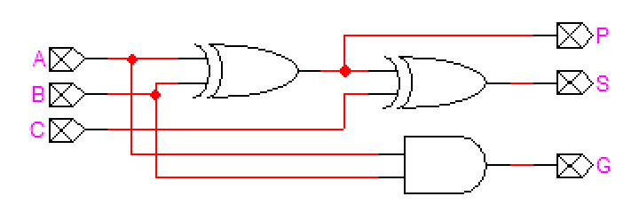
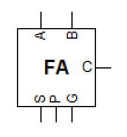

주어진 P와 G의 정의에 의하면 우리가 사용할 full adder는 위와 같이 변형된다.

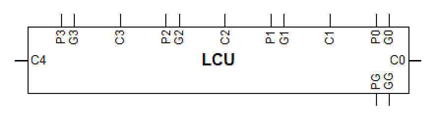

그리고 주어진 식을 이용하면 carry 값을 모두 **2-level**에 계산할 수 있게 된다. 위는 그 식을 회로도로 표현한 것이다. 이때 PG와 GG는 회로를 확장하여 4-bit 이상의 회로를 만들 때 사용되는 Propagate Group, Generate Group이다. 식은 다음과 같다:

- 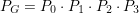
- 

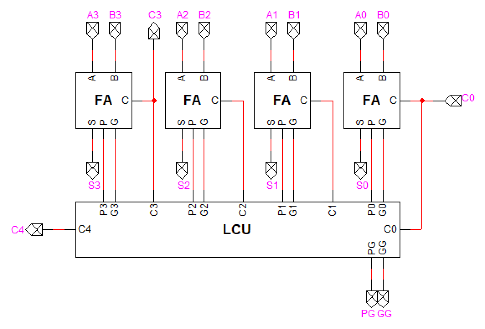
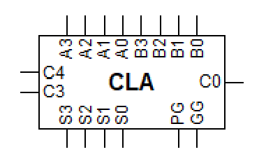

그리고 full adder들과 lookahead carry unit (LCU)을 조합하면 위와 같은 carry-lookahead adder (CLA)를 얻을 수 있다.
