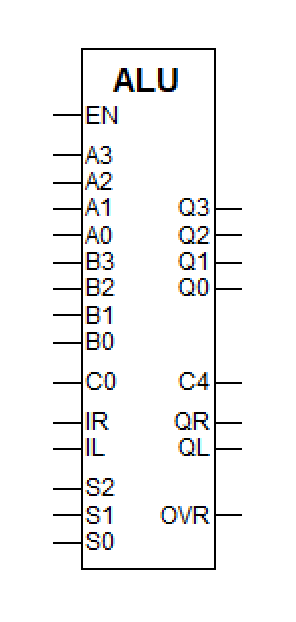
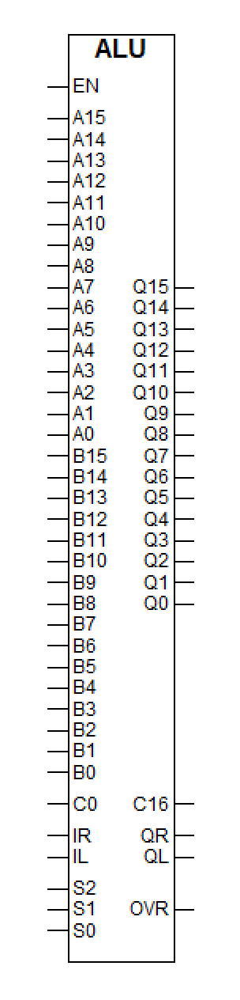
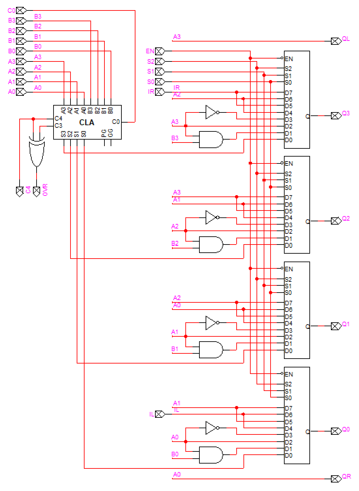
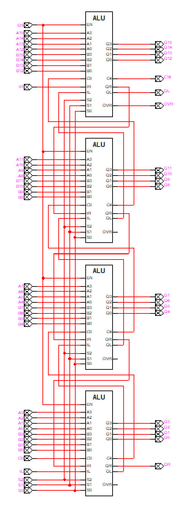

# Problem 1

### 1.

Experiment #8에서 만들었던 4-bit carry lookahead를 바탕으로 다음과 같은 6개의 function을 행할 수 있는 연산기를 만들어 library로 만들어 보시오.

### 2.

위의 4-bit ALU를 4개 연결하여 16-bit ALU를 만들고, library로 만들어 보시오.

## Answer

### 1.

### 2.

